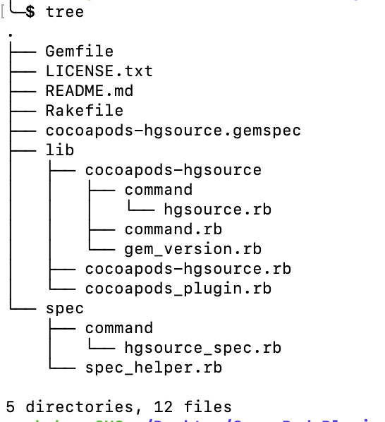
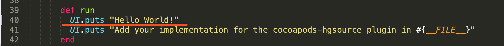
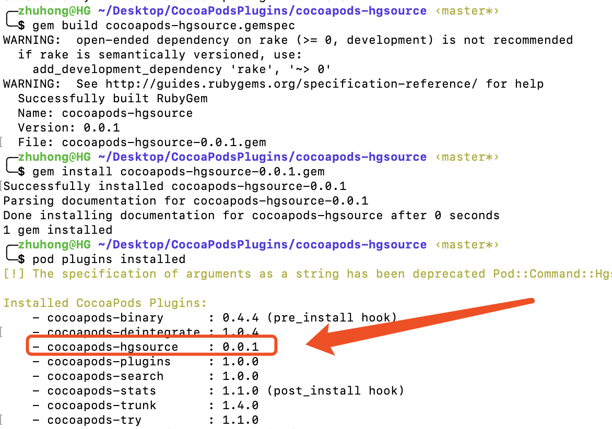
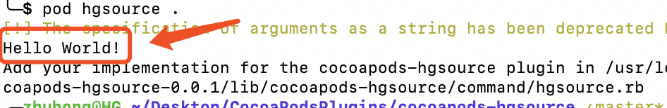
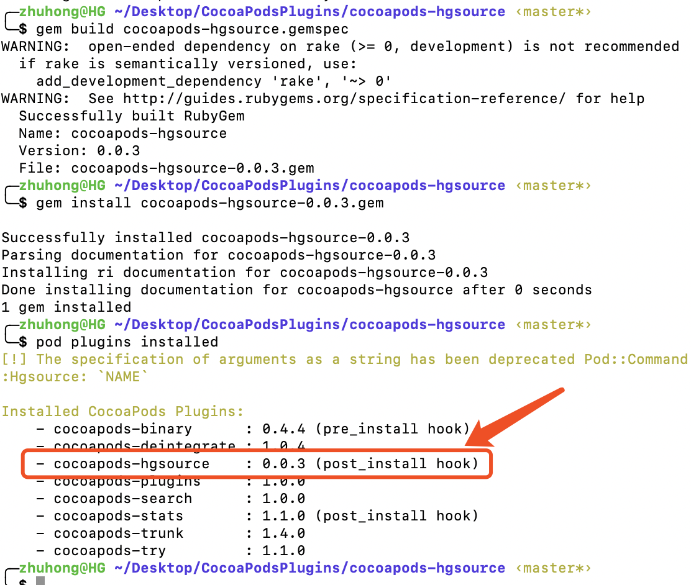
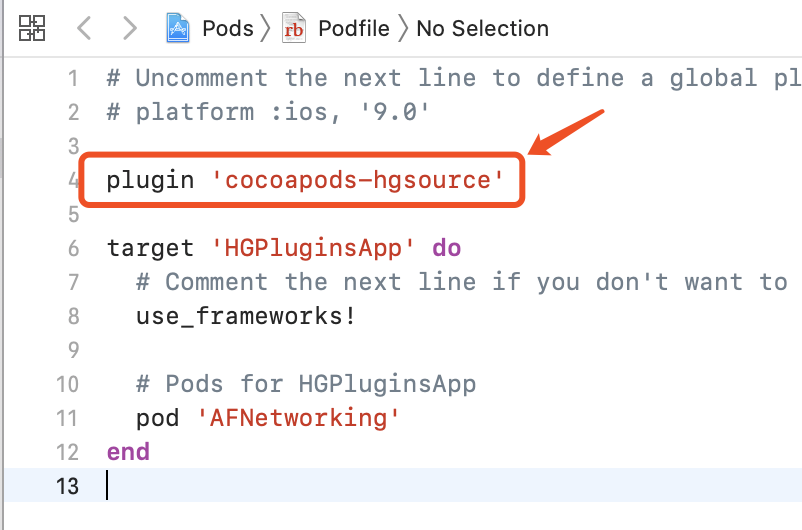
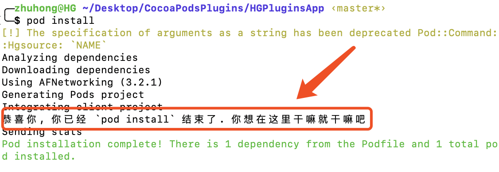

# cocoapods-hgsource

官网介绍：[How to use CocoaPods plugins](https://guides.cocoapods.org/plugins/setting-up-plugins.html), 这官网有点不地道，也没有具体的教程。

### 一、准备
先在终端试一下：
> pod plugins installed

这个指令会列出当前 Mac 已安装的插件，如果没有的话，可通过如下指令安装一下：
> gem install cocoapods-plugins

### 二、创建插件项目
输入命令：
> pod plugins create hgsource

就这样噼里啪啦的就创建结束了，


进入 文件夹：
> cd cocoapods-hgsource
> tree




接下来就要开始实现功能了，对于 CocoaPods Plugins 的开发，主要是以两种形式提现。终端命令与直接在 Podfile 文件中直接应用，这两种使用场景，在 `hgsource` 项目中入口还不一样。  
欲知更多细节，请看下节分解。
### 三、终端使用
#### 3.1 写代码
找到文件：lib/cocoapods-hgsource/command/hgsource.rb，添加如下代码:



就是这么简单。

#### 3.2 编译安装
分别执行以下命令:
> gem build cocoapods-hgsource.gemspec   
> gem install cocoapods-hgsource-0.0.1.gem  
> pod plugins installed   

最终的结果如下：  

大功告成。尝试使用一下：  
> pod hgsource .  
如下：



### 四、Podfile 中使用
#### 4.1 写代码
找到文件：lib/cocoapods_plugin.rb，添加如下代码:
``` ruby
module CocoapodsHGSource
	Pod::HooksManager.register('cocoapods-hgsource', :post_install) do |context|
		Pod::UI.puts "恭喜你, 你已经 `pod install` 结束了. 你想在这里干嘛就干嘛吧"
	end
end
```

主要功能是 hook 每次执行 `pod install` 之后的操作。接下来修改其版本号为 `0.0.3`, 类似 **3.2 编译安装** 一样，最终的结果如下：



#### 4.2 用于项目
创建一个临时项目，通过 `pod init` 创建一个 Podfile 文件，修改如下：



关键代码是:  
```ruby
plugin 'cocoapods-hgsource'
```

然后执行 `pod install`， 如下：



